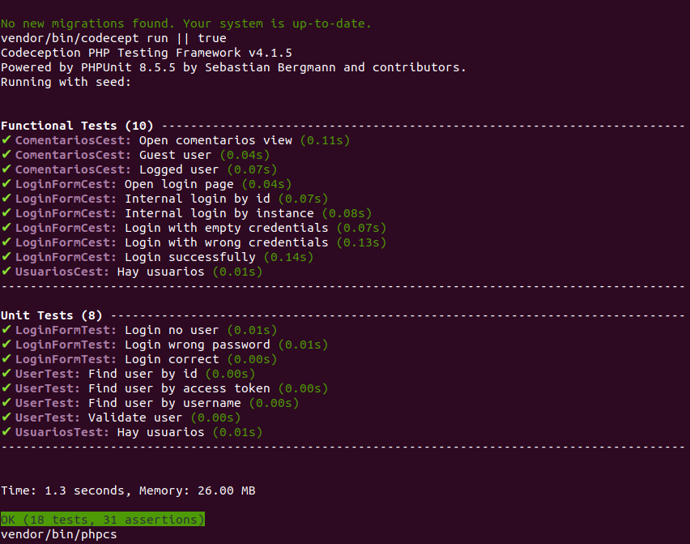
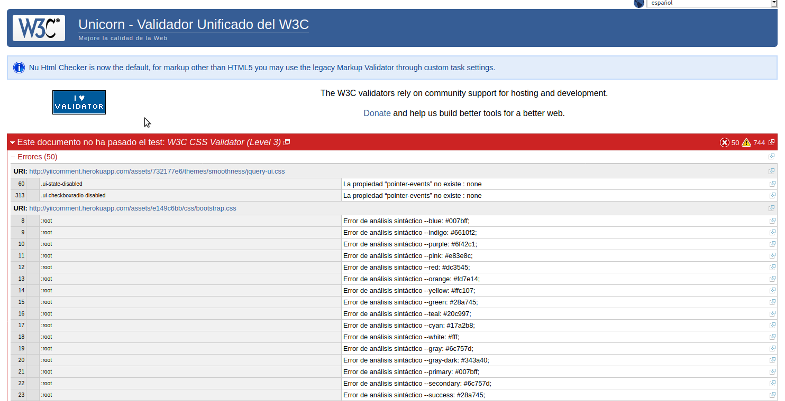

# Anexos

## **(RF25) Codeception**.

---

## **(RF26) CodeClimate**.

---

## **(RF34) Validacion HTML, CSS y Accesibilidad**.

Aunque la validacion CSS de erroes solo da erroes en algunos archivos boostrap.

---

## **(R20) ECMAScript2015 (ES6)**.

- ¿Qué sitio es éste?

    La página tendra siempre un logotipo arriba indicandote en que sitio web estas.

- ¿En qué página estoy?

    Todas las paginas contiendn un h1 dando a entender el lugar donde estas.

- ¿Cuales son las principales secciones del sitio?

    Inicio: Donde ver tus comentarios y los de la gente a la que sigues.

    Busqueda: Donde puedes buscar tanto comentarios como usuarios.

    Perfil: Donde puedes ver tus comentarios, tus me gusta y tus comentarios guardados.

- ¿Qué opciones tengo en este nivel?

    Si no estas logueado solo podras acceder al buscador, si lo estas y no eres admin puedes crear comentarios, verlos, darles a me gusta etc y si lo estas y eres admin podras administrar ademas tanto usuarios como comentarios.

- ¿Dónde estoy en el esquema de las cosas?

    En todas las paginas existe un h1 indicando donde estas.

- ¿Cómo busco algo?

    En el menu hay una seccion para bucar.

---

## **(R36) Varios navegadores**.

Mozilla.

Chrome.

Opera.

