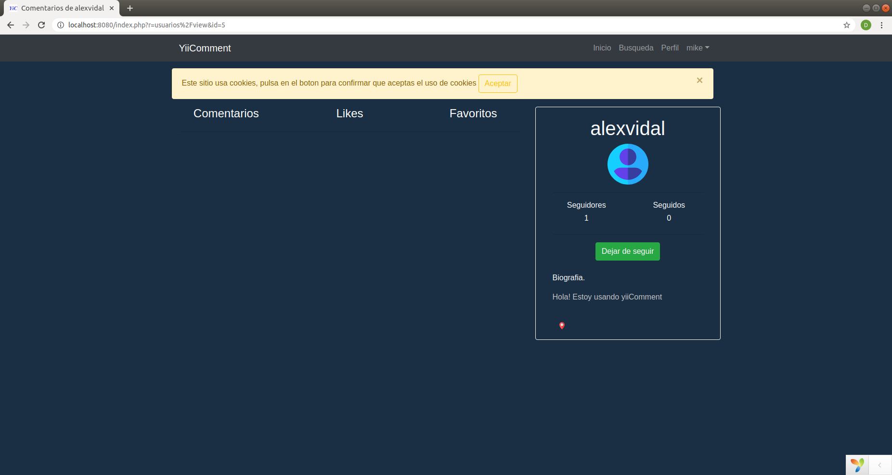

# Manual de usuario

Registro de ususarios.

Despues de esto deberemos confirmar el email.

Ya podemos logearnos.

Una vez logueado podemos acceder al index del sitio y podemos crear comentarios.

Cuando estamos registrados podemos ver nuestro perfil, nuestro me gusta y nuestros comentarios favoritos.

Tambien podemos ver los perfiles de otro usuarios y seguirlos para que sus comentarios aparezcan en nuestro index.

Podemos ver los seguidores y los seguidos de un usuario

Y tambien podemos ver los usuarios que han dado like a nuestro comentario.

Un usuario registrado puede modificar su perfil.

